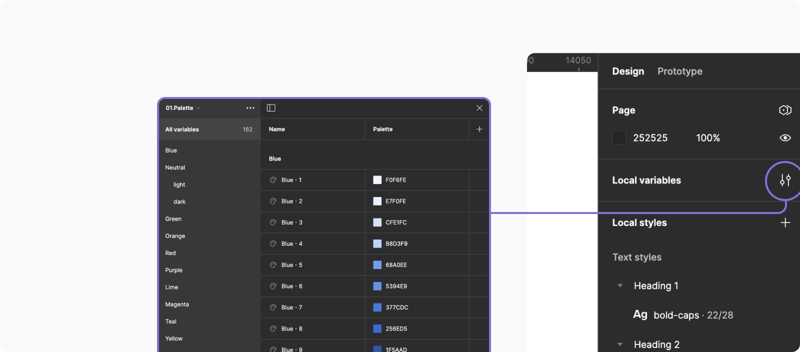

<a href="https://www.figma.com/design/PmauV3Mb2KeO2J3pcEzYAw/01.-SUI-%2F-Design-System?node-id=24601-194147">
  <h1 class="doc-header">Tokens & States 🔗</h1>
</a>

Color tokens are design decisions, translated into data. They act as a “source of truth” to help ensure that product experiences feel unified and cohesive.

## Introduction

Tokens are our way to apply visual foundations in our react based applications.

Tokens are name and value pairings that represent small, repeated design decisions. A token can be color, font style and size or even a unit of white space.

One of the most important topics are accessibility. And tokens are a great way to ensure that what we do in our applications has the right contrasts in order to secure a good user experience.

 

## Color Tokens

The way our color tokens are structured is that they all have their base in our palette. From there by making a token for each design decision we ensure that each decision is maintained properly.

- Color tokens consist of a shade or value from our palette.

- By picking colors from our list of color tokens instead of directly from our palette. We ensure that the right color is used at the right time to a higher degree than by using our palette directly.

<table style={{ width: "100%" }}>
  <tbody>
    <tr>
      <th>
        <b>Property</b>
      </th>
      <th>
        <b>Description</b>
      </th>
    </tr>
    <tr>
      <td>
        <b>`Surface`</b>
      </td>
      <td>
        Used for bigger elements in order to make hierarchy and depth on pages
      </td>
    </tr>
    <tr>
      <td>
        <b>`Background`</b>
      </td>
      <td>
        Colors for backgrounds on smaller elements and components such as
        buttons, badges, inputs and more
      </td>
    </tr>
    <tr>
      <td>
        <b>`Stroke`</b>
      </td>
      <td>
        Used to make elements stand out and increase variant and/or contrast on
        background.
      </td>
    </tr>
    <tr>
      <td>
        <b>`Text`</b>
      </td>
      <td>Colors designated for text use only</td>
    </tr>
    <tr>
      <td>
        <b>`Icon`</b>
      </td>
      <td>Colors designated for iconography use only</td>
    </tr>
  </tbody>
</table>

By following the same pattern on each of these categories you end up with colors working together.

<Image src="../../../../assets/images/color-token-structure.png" alt="Color token structure" />

**Illustration:** _The first word in any token tells us what kind of token it is.
Color, spacing or Border radius token. Spacing and border radius tokens falls under
the category “value tokens” as they are built up of a single value. And are means
to secure that we are using the correct amount of “white space” in our applications_

 

<table style={{ width: "100%" }}>
  <tbody>
    <tr>
      <th>
        <b>Property</b>
      </th>
      <th>
        <b>Role</b>
      </th>
      <th>
        <b>Emphasis</b>
      </th>
      <th>
        <b>State</b>
      </th>
    </tr>
    <tr>
      <td>
        <b>`Surface`</b>
         
        <b>`Background`</b>
         
        <b>`Stroke`</b>
         
        <b>`Text`</b>
         
        <b>`Icon`</b>
      </td>
      <td>danger</td>
      <td>solid</td>
      <td>hover</td>
    </tr>
  </tbody>
</table>
**Illustration:** _Shows how a token color state could look like for a component_

 

## Component States

- <b>`Default`</b> : Used for the default state of a component
- <b>`Hover`</b> : Occurs when hovering over a component
- <b>`Active`</b> : The active state of a component (on / off)
- <b>`Focus`</b> : When tabbing to a component or giving focus through other means
- <b>`Disabled`</b> : When the component is not interactable and out of potential
  of focus
- <b>`OnClick`</b> : In the process of clicking a component

 

## Value Tokens

### Radius

<table style={{ width: "100%" }}>
  <tbody>
    <tr>
      <th>
        <b>Name</b>
      </th>
      <th>
        <b>Pixel</b>
      </th>
      <th>
        <b>Rem</b>
      </th>
    </tr>
    <tr>
      <td>
        <b>`radius.none`</b>
      </td>
      <td>0 px</td>
      <td>0 rem</td>
    </tr>
    <tr>
      <td>
        <b>`radius.tiny`</b>
      </td>
      <td>2 px</td>
      <td>0.2 rem</td>
    </tr>
    <tr>
      <td>
        <b>`radius.small`</b>
      </td>
      <td>4 px</td>
      <td>0.4 rem</td>
    </tr>
    <tr>
      <td>
        <b>`radius.medium`</b>
      </td>
      <td>6 px</td>
      <td>0.6 rem</td>
    </tr>
    <tr>
      <td>
        <b>`radius.large`</b>
      </td>
      <td>8 px</td>
      <td>0.8 rem</td>
    </tr>
    <tr>
      <td>
        <b>`radius.xlarge`</b>
      </td>
      <td>10 px</td>
      <td>1 rem</td>
    </tr>
    <tr>
      <td>
        <b>`radius.xxlarge`</b>
      </td>
      <td>12 px</td>
      <td>1.2 rem</td>
    </tr>
    <tr>
      <td>
        <b>`radius.round`</b>
      </td>
      <td>200 px</td>
      <td>20 rem</td>
    </tr>
  </tbody>
</table>

### Spacing

<table style={{ width: "100%" }}>
  <tbody>
    <tr>
      <th>
        <b>Name</b>
      </th>
      <th>
        <b>Pixel</b>
      </th>
      <th>
        <b>Rem</b>
      </th>
    </tr>
    <tr>
      <td>
        <b>`spacing.none`</b>
      </td>
      <td>0 px</td>
      <td>0 rem</td>
    </tr>
    <tr>
      <td>
        <b>`spacing.tiny`</b>
      </td>
      <td>4 px</td>
      <td>0.4 rem</td>
    </tr>
    <tr>
      <td>
        <b>`spacing.small`</b>
      </td>
      <td>8 px</td>
      <td>0.8 rem</td>
    </tr>
    <tr>
      <td>
        <b>`spacing.medium`</b>
      </td>
      <td>12 px</td>
      <td>1.2 rem</td>
    </tr>
    <tr>
      <td>
        <b>`spacing.large`</b>
      </td>
      <td>24 px</td>
      <td>2.4 rem</td>
    </tr>
    <tr>
      <td>
        <b>`spacing.xlarge`</b>
      </td>
      <td>48 px</td>
      <td>4.8 rem</td>
    </tr>
  </tbody>
</table>

 

## Tokens in Figma

All tokens can be found as <b>`Local variables`</b>  
Here we make our tokens and they are divided into seperate lists.

- 01.Palette
- 02.Colors
- 03.Value tokens

